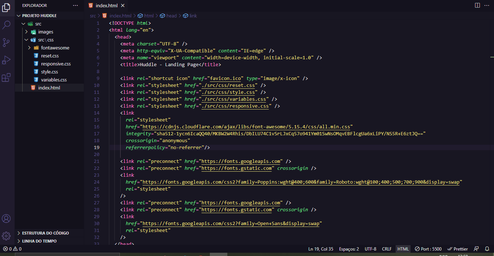

# Título do Projeto 

'Página Inicial do Projeto Huddle'

## Descrição

Página landing page do site Frontend Mentor, proposta feita pelo curso 'Programador Full Stack' da plataforma Dev em Dobro. 

## Referência

 - [Frontend Mentor]https://www.frontendmentor.io/challenges/huddle-landing-page-with-a-single-introductory-section-B_2Wvxgi0

## Autores

- [Ariane] https://github.com/Ariane-PS

## Documentação de cores

- Violet: hsl(257, 40%, 49%)
- Soft Magenta: hsl(300, 69%, 71%)

## Demonstração e Screenshots

[]
[]
[]

## Funcionalidades

- Marcação HTML5 semântica

- Propriedades personalizadas CSS

- Flexbox

- Responsividade Desktop à mobile.

## Aprendizados

- Com esse projeto eu puder trabalhar mais aprofundado vários conceitos do css, flexbox e/ou grid, e claro html.

- Também trabalhei bastante com responsividade, que foi o ponto mais desafiador para mim.